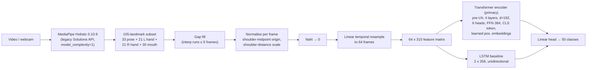

# Real-Time British Sign Language Recognition

**A Pose-Based Transformer Approach for Word-Level BSL Classification**

*S M Shamrat Tarek Hassan — MSc Data Science*

This repository contains an **assistive research demonstrator** for isolated, word-level
British Sign Language recognition over a 50-word vocabulary. Video is reduced to a compact
skeletal representation (a 105-landmark subset of MediaPipe Holistic: body pose, both hands
and the mouth region), normalised into a signer-centred coordinate frame, and classified by
a ~1M-parameter transformer encoder written from scratch in PyTorch, benchmarked against a
matched-capacity LSTM baseline. The system targets real-time operation on a laptop CPU and
is framed throughout as a learning/lookup aid for citation-form signs — it is **explicitly
not an interpreting service** and does not attempt continuous signing, spatial grammar or
non-manual sentence-level features.

## Architecture



Real-time mode keeps a rolling buffer of the last 64 normalised frames, classifies every 8
frames, and only displays a prediction once the same top-1 class clears a 0.6 confidence
threshold for 3 consecutive windows.

## Repository structure

```
bsl-word-transformer/
├── app/
│   └── app.py               # Gradio demonstrator (upload/webcam clip -> top-5 signs)
├── configs/                  # 12 run configs: {arch}_{aug|noaug}_s{seed}.yaml
├── data/
│   ├── metadata.csv          # per-clip provenance incl. source URLs (tracked)
│   ├── vocabulary.csv        # 50-word vocabulary (tracked)
│   ├── splits.json           # organisation-grouped train/val split (tracked)
│   ├── raw_videos/           # downloaded dictionary clips (gitignored, never redistributed)
│   ├── landmarks/            # cached .npz landmark sequences (gitignored)
│   ├── test_videos/          # held-out test clips (gitignored)
│   └── test_landmarks/       # cached test landmarks (gitignored)
├── notebooks/
│   ├── eda.ipynb             # exploratory data analysis + split creation
│   ├── results.ipynb         # regenerates every dissertation figure/table
│   ├── run_all_colab.ipynb   # one-shot Colab run of the full pipeline
│   └── train_colab.ipynb     # GPU training of the full grid on Google Colab
├── src/
│   ├── landmarks.py          # landmark index constants (105-point subset)
│   ├── download.py           # polite SignBSL.com scraper
│   ├── extract.py            # MediaPipe Holistic -> cached .npz landmarks
│   ├── normalise.py          # shoulder-centred, shoulder-scaled normalisation
│   ├── augment.py            # spatial + temporal augmentation
│   ├── dataset.py            # BSLDataset, resampling, split creation
│   ├── models.py             # from-scratch transformer + LSTM baseline
│   ├── train.py              # training loop, sanity modes, checkpointing
│   ├── evaluate.py           # metrics, confusion matrix, McNemar's test
│   ├── benchmark.py          # per-stage latency benchmark
│   └── realtime.py           # live webcam demo with rolling buffer
├── tests/                    # pytest suite (runs without data or mediapipe)
├── requirements.txt
├── pytest.ini
├── decision_log.md
├── LICENSE
└── README.md
```

## Quickstart

```bash
conda create -n bsl python=3.11 -y
conda activate bsl
pip install -r requirements.txt
pytest            # sanity: full test suite runs with no data downloaded
```

## Full workflow (in order)

1. **Check availability** (writes nothing, prints per-word clip counts):

   ```bash
   python -m src.download --dry-run
   ```

2. **Download** dictionary clips politely (1 request/s, identifying user agent; idempotent):

   ```bash
   python -m src.download
   ```

3. **Extract landmarks** with MediaPipe Holistic into cached `.npz` files
   (repeat with `--videos data/test_videos --out data/test_landmarks` for the held-out test set):

   ```bash
   python -m src.extract --videos data/raw_videos --out data/landmarks
   ```

4. **Create splits** grouped by source organisation (no organisation leaks across train/val):

   ```bash
   python -m src.dataset --make-splits
   ```

5. **EDA** — run `notebooks/eda.ipynb` top-to-bottom (clip counts, durations vs the
   64-frame budget, hand-dropout by source, skeleton overlays, organisation distribution).

6. **Train the 12-run grid** ({transformer, lstm} x {aug, noaug} x seeds {42, 43, 44}):

   ```bash
   # bash
   for cfg in configs/*.yaml; do python -m src.train --config "$cfg"; done
   ```

   ```powershell
   # PowerShell
   Get-ChildItem configs/*.yaml | ForEach-Object { python -m src.train --config $_.FullName }
   ```

   For GPU training use `notebooks/train_colab.ipynb`.

7. **Evaluate on validation** (per checkpoint; writes predictions, per-class accuracy,
   confusion matrix):

   ```bash
   python -m src.evaluate --checkpoint results/runs/transformer_aug_s42/best.pt --split val
   ```

8. **One-shot test evaluation** — after model selection is frozen on validation results,
   the held-out test set is evaluated **exactly once** per selected model:

   ```bash
   python -m src.evaluate --checkpoint results/runs/<best_run>/best.pt --split test
   ```

9. **Benchmark latency** against the >= 15 fps / < 100 ms criteria
   (`--synthetic` for machines without a camera/mediapipe):

   ```bash
   python -m src.benchmark --checkpoint results/runs/<best_run>/best.pt --webcam 0 --frames 1000 --stride 8
   ```

10. **Demo app** (and `python -m src.realtime --checkpoint ...` for the live cv2 demo):

    ```bash
    python app/app.py
    ```

Finally, `notebooks/results.ipynb` regenerates every dissertation figure and table from
`results/runs/*`.

## Sanity checks

- **Overfit one batch** — `python -m src.train --config configs/transformer_aug_s42.yaml --overfit-batch`
  must reach >= 95% train accuracy within 200 steps, proving the model/loss/optimiser wiring.
- **Label shuffle** — `python -m src.train --config configs/transformer_aug_s42.yaml --shuffle-labels`
  must leave validation accuracy near chance (1/50 = 2%), proving no label leakage.
- **Determinism** — repeating a short run with the same seed reproduces `metrics.csv` exactly
  (seeded generators, `num_workers=0`, cuDNN deterministic).
- **Normalisation invariance** — unit tests assert the normalised skeleton is invariant to
  global translation and uniform rescaling: `pytest tests -k normalise`.
- **Parameter count** — printed at model construction; transformer ~1M, LSTM within ~12% of
  it; exact counts are reported.
- **Augmentation visual** — the final cells of `notebooks/eda.ipynb` plot original vs
  augmented skeletons to confirm transforms are label-preserving and sensibly scaled.

## Reproducibility

- Every experiment is one YAML config in `configs/`; the config is copied into its run
  directory together with `env.txt` (Python/torch/numpy versions + git commit hash).
- Three seeds per condition (42/43/44); results are reported as mean +- std over seeds.
- All dependency versions are pinned in `requirements.txt`; MediaPipe is hard-pinned to
  0.10.9 (legacy Solutions API) so landmark extraction is identical everywhere.
- Model selection uses best validation accuracy over 80 epochs, no early stopping.
- **One-shot test discipline**: the test set is never used for any tuning decision and is
  evaluated exactly once per finally-selected model.
- `data/splits.json` (seeded, organisation-grouped) is committed, so the exact train/val
  partition is part of the repository.

## Ethics and data statement

- Source videos are professionally produced BSL dictionary clips located through
  SignBSL.com, downloaded politely (sequential requests, >= 1 s delay, identifying
  user agent) for non-commercial academic research.
- **Raw videos are never redistributed**: `data/raw_videos/` and `data/test_videos/` are
  gitignored. The repository ships only derived landmark coordinates and
  `data/metadata.csv` with source URLs, so others can re-fetch the originals themselves.
- No new human-subject data is collected; the webcam demo processes frames in memory only
  and stores nothing.
- The system recognises isolated, citation-form signs from a 50-word vocabulary. It is an
  assistive research demonstrator for learning and lookup. It is **not** an interpreter,
  and its outputs must not be relied on for communication in place of qualified human
  BSL interpretation.

## Licence

Released under the MIT Licence (see `LICENSE`). Copyright (c) 2026 S M Shamrat Tarek Hassan.
